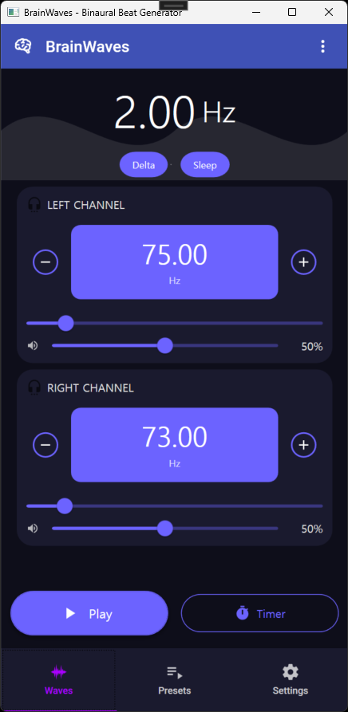
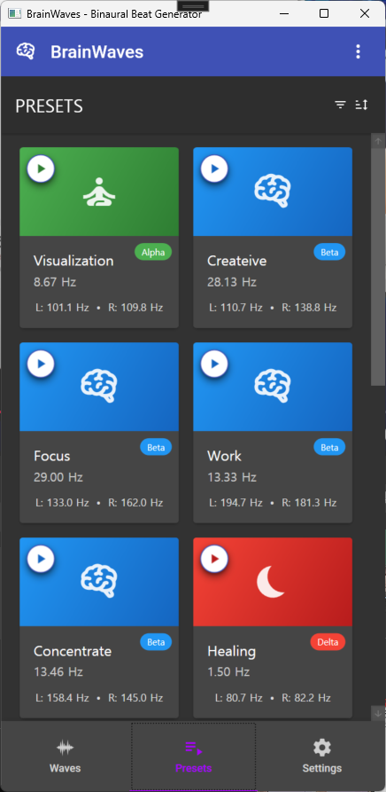
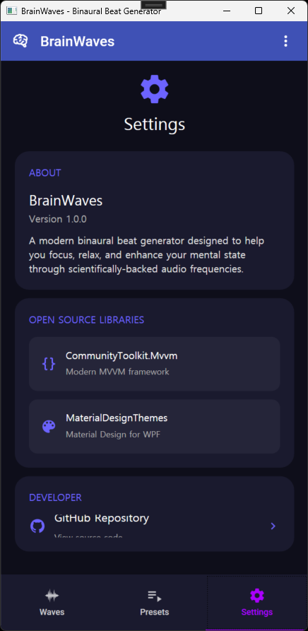

# 🧠 BrainWaves - 모던 바이노럴 비트 생성기

<p align="center">
  
</p>

<p align="center">
  <b>과학적으로 설계된 바이노럴 비트로 당신의 정신 상태를 변화시키세요</b>
</p>

<p align="center">
  <a href="#주요-기능">주요 기능</a> •
  <a href="#스크린샷">스크린샷</a> •
  <a href="#설치-방법">설치 방법</a> •
  <a href="#사용법">사용법</a> •
  <a href="#프리셋">프리셋</a> •
  <a href="#기술-스택">기술 스택</a>
</p>

---

## 🌟 개요

BrainWaves는 다양한 정신 상태를 달성하는 데 도움을 주는 바이노럴 비트를 생성하는 모던한 Windows 데스크톱 애플리케이션입니다. 각 귀에 약간 다른 주파수를 재생하여 뇌파 패턴에 영향을 줄 수 있는 청각적 착각을 만들어냅니다.

## ✨ 주요 기능

### 🎵 **정밀한 주파수 제어**
- 좌우 채널 독립적인 주파수 조절 (0.01Hz 정밀도)
- 실시간 스테레오 WAV 오디오 생성
- 각 채널별 개별 볼륨 조절
- 아름답고 직관적인 다크 테마 UI

### 🧘 **13가지 과학적으로 설계된 프리셋**
- **수면 & 휴식**: 깊은 휴식을 위한 델타파와 세타파
- **집중 & 생산성**: 향상된 집중력을 위한 베타파
- **창의성 & 학습**: 창의적 사고를 위한 알파파
- **최고 성능**: 인지 능력 향상을 위한 감마파

### 🎨 **모던한 Material Design**
- 네이비 배경(#0E0E1A)의 우아한 다크 테마
- 쉬운 식별을 위한 파동 유형별 색상 구분
- 부드러운 애니메이션과 트랜지션
- 반응형 사용자 친화적 인터페이스

## 📸 스크린샷

<table>
  <tr>
    <td align="center">
      <br>
      <b>웨이브 컨트롤</b><br>
      <sub>수동으로 주파수 미세 조정</sub>
    </td>
    <td align="center">
      <br>
      <b>프리셋 라이브러리</b><br>
      <sub>최적화된 설정에 빠르게 접근</sub>
    </td>
    <td align="center">
      <br>
      <b>설정</b><br>
      <sub>앱 정보 및 구성</sub>
    </td>
  </tr>
</table>

## 🧠 프리셋

| 프리셋 | 파동 유형 | 주파수 (Hz) | 목적 |
|--------|-----------|----------------|---------|
| 🌙 **깊은 수면** | 델타 | 1.63 | 가장 깊은 수면 단계 |
| 😴 **수면** | 델타 | 2.00 | 일반적인 수면 유도 |
| 🧘 **명상** | 세타 | 4.50 | 깊은 명상 |
| 🌊 **휴식** | 세타 | 4.56 | 스트레스 해소 |
| 👁️ **시각화** | 알파 | 8.67 | 정신적 이미지화 |
| 🎯 **집중** | 베타 | 29.00 | 강렬한 집중력 |
| 🎨 **창의성** | 베타 | 28.13 | 창의적 사고 |
| 💡 **인지** | 감마 | 40.00 | 최고의 정신 성능 |

## 💻 시스템 요구사항

- **OS**: Windows 10 이상
- **프레임워크**: .NET 8.0 Runtime
- **오디오**: 스테레오 헤드폰 또는 이어폰 (바이노럴 효과를 위해 필수)
- **RAM**: 최소 4GB
- **저장 공간**: 100MB 여유 공간

## 🚀 설치 방법

### 옵션 1: 릴리스 다운로드
1. [Releases](https://github.com/Sia819/BrainWavesWPF/releases) 페이지로 이동
2. 최신 `BrainWaves.zip` 다운로드
3. 압축 해제 후 `BrainWaves.exe` 실행

### 옵션 2: 소스에서 빌드
```bash
# 저장소 클론
git clone https://github.com/Sia819/BrainWavesWPF.git
cd BrainWavesWPF

# 프로젝트 빌드
dotnet build

# 애플리케이션 실행
dotnet run --project BrainWaves/BrainWaves/BrainWaves.csproj
```

## 📖 사용법

### 시작하기
1. **스테레오 헤드폰 착용** - 바이노럴 비트 효과에 필수
2. **방법 선택**:
   - **빠른 시작**: Presets 탭에서 프리셋 선택
   - **사용자 정의**: Waves 탭에서 수동으로 주파수 조정
3. **Play 버튼**을 눌러 세션 시작
4. 필요에 따라 게인 슬라이더로 **볼륨 조정**

### 프로 팁
- 🎧 최상의 결과를 위해 좋은 품질의 헤드폰 사용
- ⏱️ 일반적으로 15-30분 세션이 가장 효과적
- 🌙 수면을 위해서는 잠들기 30분 전부터 재생
- 🎯 집중을 위해서는 작업이나 공부 중에 사용

## ⚠️ 안전 주의사항

- **운전 중 사용 금지** 또는 기계 조작 시
- **간질이나 발작 장애가 있는 경우 사용 금지**
- 불편함을 느끼면 **사용 중단**
- **의료 기기가 아님** - 의학적 상태에 대해서는 의료 전문가와 상담

## 🛠️ 기술 스택

- **프레임워크**: WPF with .NET 8.0
- **아키텍처**: MVVM 패턴
- **UI 라이브러리**: MaterialDesignThemes (5.2.2)
- **MVVM 프레임워크**: CommunityToolkit.Mvvm (8.4.0)
- **오디오**: 커스텀 WAV 생성을 통한 System.Media.SoundPlayer

## 🤝 기여하기

기여를 환영합니다! Pull Request를 자유롭게 제출해 주세요.

1. 저장소 포크
2. 기능 브랜치 생성 (`git checkout -b feature/AmazingFeature`)
3. 변경사항 커밋 (`git commit -m 'Add some AmazingFeature'`)
4. 브랜치에 푸시 (`git push origin feature/AmazingFeature`)
5. Pull Request 열기

## 📜 라이선스

이 프로젝트는 GNU Affero General Public License v3.0을 따릅니다 - 자세한 내용은 [LICENSE](LICENSE) 파일을 참조하세요.

## 🙏 감사의 말

- Google의 Material Design Icons
- 다양한 과학 출판물의 바이노럴 비트 주파수 연구
- 놀라운 라이브러리를 제공한 오픈소스 커뮤니티

---

<p align="center">
  <a href="https://github.com/Sia819">Sia819</a>가 ❤️를 담아 만들었습니다
</p>

<p align="center">
  <a href="https://github.com/Sia819/BrainWavesWPF/issues">버그 신고</a> •
  <a href="https://github.com/Sia819/BrainWavesWPF/issues">기능 요청</a>
</p>